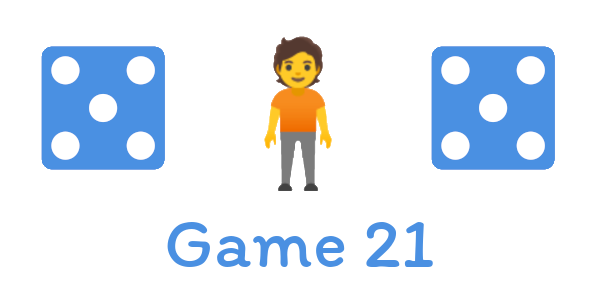
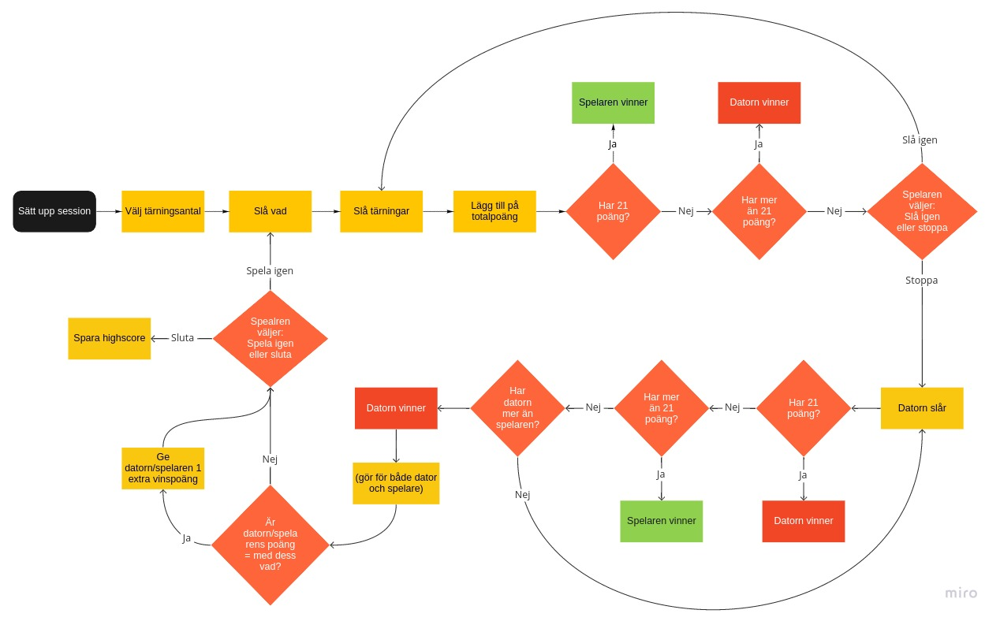

<p align="center"></p>

# dbwebb proj - manh20

This is my final project in the course mvc-v1 at BTH. It's an implementation of the game "Game 21" including a betting feature, scoreboard and statistics.

The application is built with PHP and the Laravel framework. The database used is MySQL and is accessed through the Artisan ORM.

## Getting started

Follow the steps outlined below to get the project running locally.

1. Start by cloning the repo and entering the project
    ```sh
    git clone git@github.com:scriptcoded/dbwebb-mvc-proj.git
    cd dbwebb-mvc-proj
    ```
1. Install composer dependencies
    ```sh
    composer install
    ```
1. Copy the example env file and change it to your liking
    ```sh
    cp .env.example .env
    ```
1. Start the project using Laravel Sail
    ```sh
    ./vendor/bin/sail up
    ```
1. When the Laravel Sail database has fully started, migrate the database.
    ```sh
    ./vendor/bin/sail artisan migrate
    ```
1. In a new terminal, install NPM dependencies
    ```sh
    npm install
    ```
1. Start Laravel Mix
    ```sh
    npm run watch
    ```
1. Hack away!

## Flowchart



## About

Made by [Malcolm Nihlén](https://github.com/scriptcoded).
